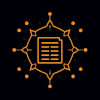
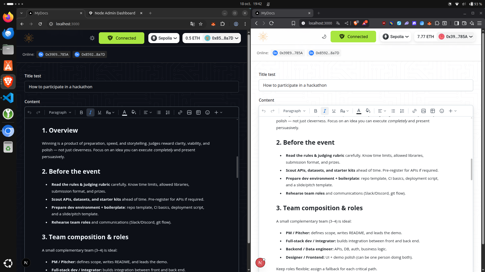

 

  

  <h3 align="center">MyDocs</h3>

  

    A decentralized, self-sovereign platform for collaborative document editing.
     
    <i>Build at ETH Rome 2025</i>
     
  

## About The Project

MyDocs is your Web3 Notion - A decentralized, self-sovereign collaboration platform that enables **multiple participants to work together seamlessly across different nodes in real time**. It ensures that users retain full ownership, control, and protection of their data. By combining decentralization with verified off-chain computing, MyDocs eliminates the need for centralized intermediaries, offering a secure, transparent, and efficient environment for data-driven collaboration.

### Built With

- Calimero Network - A framework that enables building and running peer-to-peer Self-Sovereign applications focusing on data ownership and harnessing the power of verified off-chain computing.

- ENS (Ethereum Name Service) - A decentralized domain naming system on Ethereum that maps human-readable names (e.g., alice.eth) to blockchain addresses and other data.

## Getting Started

Go to the `drive` repository please.
